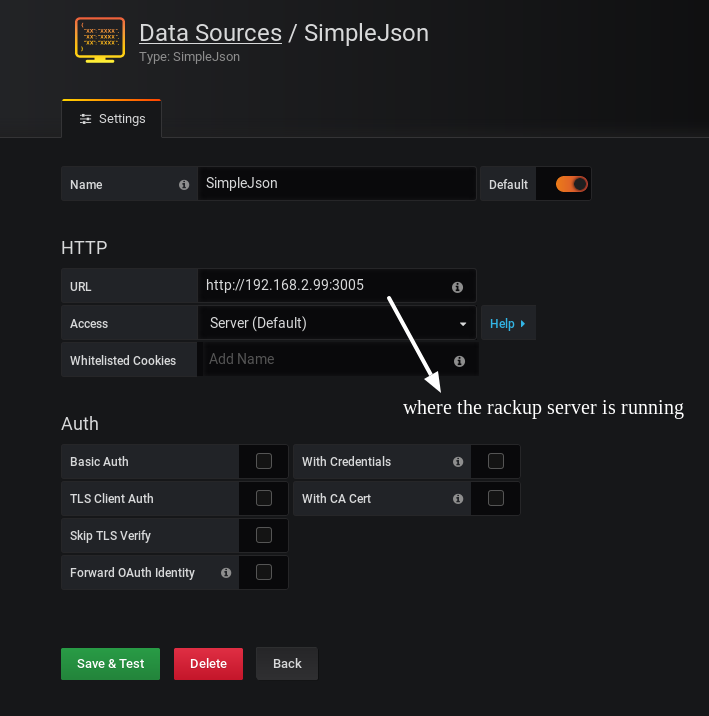
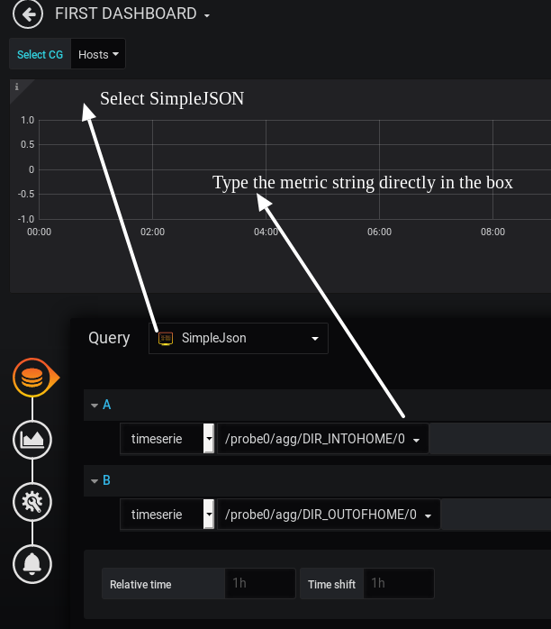

# grafana-server

A very simple JSON server to show Trisul Metrics in a Grafana Dashboard

## A dead simple Ruby rack based server

The *trisul-grafana-server* is a very simple and fast server that allows to you show Trisul Network Analytics time series graphs in Grafana.


 1. Uses the simple-json-server Grafana Datasource
 2. *Has no authentication* at the moment.  Use with caution on internal network. We will be adding auth soon.


## Using

### Step 1: Install the simple-json-datasource  

Follow the instructions in https://github.com/grafana/simple-json-datasource?utm_source=grafana_add_ds  to install the SimpleJSON datasource.

Restart grafana-server


### Step 2: Start the Trisul Grafana server 

1. Copy the file `grafana-server.ru` to the Web Trisul server. 
2. Set the ruby environment on the Web Trisul server
   ````
   sudo -i 
   cd /usr/local/share/webtrisul
   source build/switch_local_ruby
   ````
3. In that same session start the server (assume you want to run on port 3005 and bind to IP 192.168.2.99) 
   ````
   rackup trisul-grafana-server.ru  -p 3005 -o 192.168.2.99                                                                                                         
   ````


### Step 3: Configure the SimpleJSON datasource 

On Grafana , go to Configuration > Data Source then specify the connection to the server you configured in Step 2 




### Step 4: Create your dashboards using a special metric format.


#### First a quick look at the Trisul Metric format

Metrics are identified by a string with the following format 

__/probe-id/counter group name/key or label/meter number__

*For example*

* `/probe0/apps/http/0` refers to the _metric 0_ (total bytes) of the _HTTP_ item in the _Applications_ counter group from _probe0_
* The counter group name is matched by the first few characters converted to lowercase, *`/probe0/apps/http/0`* is the same as
`/probe0/Applications/http/0`  
* To get a list of counters and meters login to Trisul and go to Customize > View Meters 

*Probe is optional* 

You can leave the *probe* part blank if you only have a single probe or you want to get data from ALL PROBES combined.
So you would do `//apps/http/0` 


Create a new dashboard , then start adding Trisul Metrics as shown below. Just enter the strings directly 




## Enjoy the view 


