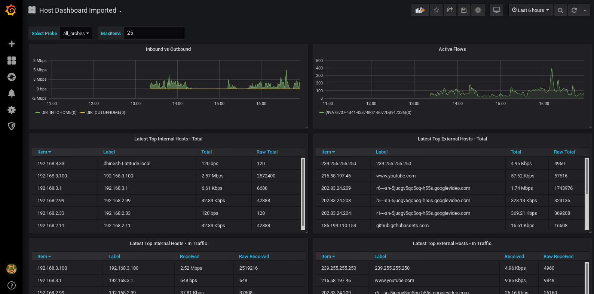

# grafana-server

A very simple JSON server to show Trisul Metrics in a Grafana Dashboard

## A dead simple Ruby rack based server

The *trisul-grafana-server* is a very simple and fast server that allows to you show Trisul Network Analytics time series graphs in Grafana.


 1. Uses the simple-json-server Grafana Datasource
 2. *Has no authentication* at the moment.  Use with caution on internal network. We will be adding auth soon.


## Step 1: Install the simple-json-datasource  

Follow the instructions in https://github.com/grafana/simple-json-datasource?utm_source=grafana_add_ds  to install the SimpleJSON datasource.

Restart grafana-server


## Step 2: Start the Trisul Grafana server 


This is the small rack server to drive the Grafana JSON query interface.

1. Download and unzip the latest release from https://github.com/trisulnsm/grafana-server/releases to the Web Trisul server 
2. Start the trisu-grafana server

You can use the built in Ruby server stack on the Web Trisul server to start the server. 

   ````
   sudo -i 
   cd /usr/local/share/webtrisul
   source build/switch_local_ruby
   ````
   In that same session start the server (assume you want to run on port 3005 and bind to IP 192.168.2.99) 
   ````
   rackup trisul-grafana-server.ru  -p 3005 -o 192.168.2.99                                                                                                         
   ````

   You can also use your platforms  Ruby / Rack if you wish. The goal is to start the rackup server.


## Step 3: Configure the SimpleJSON datasource 

On Grafana , go to Configuration > Data Source then specify the connection to the server you configured in Step 2 


## Step 4: Create your dashboards using a special metric format.


### First a quick look at the Trisul Metric format

Metrics are identified by a string with the following format 

__/probe-id/counter group name/key or label/meter number__


* `/probe0/apps/http/0` refers to the _metric 0_ (total bytes) of the _HTTP_ item in the _Applications_ counter group from _probe0_
* The counter group name is matched by the first few characters converted to lowercase, *`/probe0/apps/http/0`* is the same as
`/probe0/Applications/http/0`  
* To get a list of counters and meters login to Trisul and go to Customize > View Meters 
* You can leave the *probe* part blank if you only have a single probe or you want to get data from ALL PROBES combined.
So you would do `//apps/http/0` 

#### How to get Toppers into a table

* You can put toppers from any counter group in a table by using the special key _toppers_  You can add a _table_ in Grafana such as _/probe0/apps/toppers(5)/0_ This gets the top 5 applications of meter 0 (Total bandwidth) into a table

#### How to get Topper history timeseries into a chart 

* Sometimes you want to see the timeseries for a bunch of toppers. 
* Create a _timeserie_  query , then use the _//apps/toppers(5)/0_  format


### Start adding queries to  dashboards 

Create a new dashboard , then start adding Trisul Metrics as shown below. Just enter the strings directly 


## Enjoy the view 

Here is a sample dashboard




